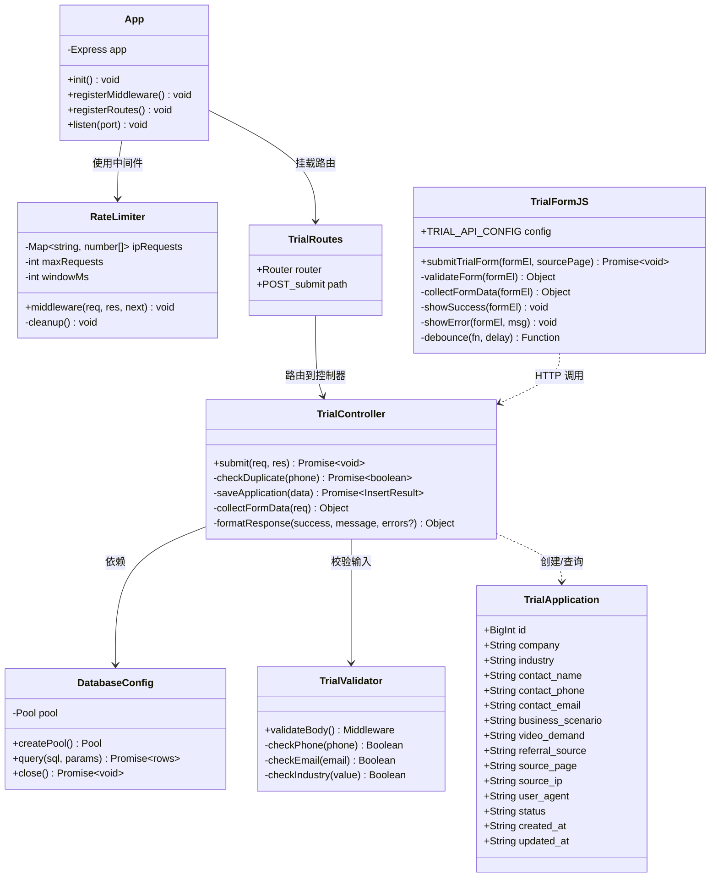
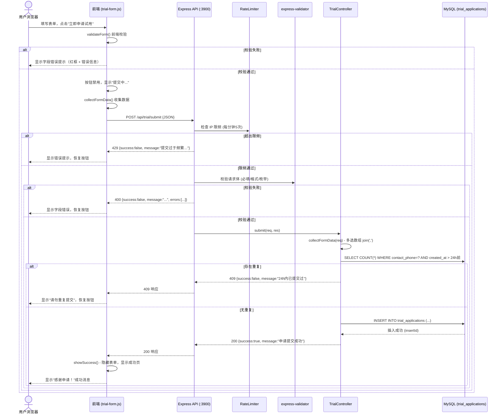
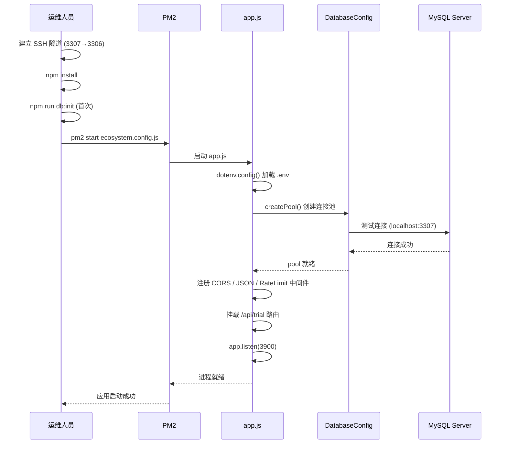
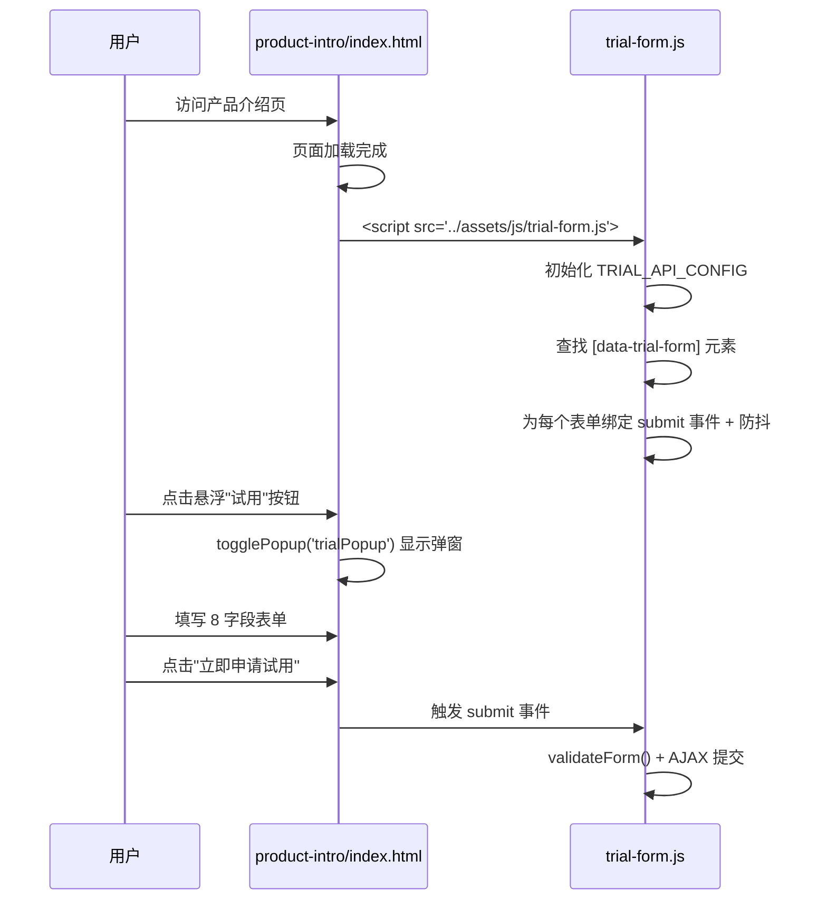
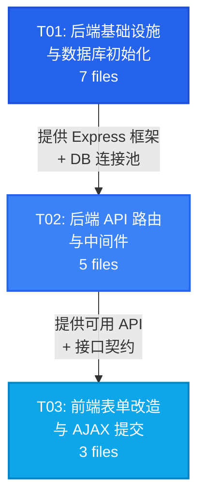

# 营赛智影官网 - 试用表单系统架构设计

> **文档版本**: v1.0  
> **架构师**: Bob  
> **日期**: 2026-08-11  
> **项目根目录**: `D:\东信工作\智影商业版\网站\zhenyu\zhenyu`

---

## 目录

- [Part A: 系统设计](#part-a-系统设计)
  - [1. 实现方案与框架选型](#1-实现方案与框架选型)
  - [2. 文件列表](#2-文件列表)
  - [3. 数据结构与接口](#3-数据结构与接口)
  - [4. 程序调用流程](#4-程序调用流程)
  - [5. 待明确事项](#5-待明确事项)
- [Part B: 任务分解](#part-b-任务分解)
  - [6. 依赖包列表](#6-依赖包列表)
  - [7. 任务列表](#7-任务列表)
  - [8. 共享知识](#8-共享知识)
  - [9. 任务依赖图](#9-任务依赖图)

---

## Part A: 系统设计

### 1. 实现方案与框架选型

#### 1.1 核心技术挑战

| 挑战 | 说明 | 解决方案 |
|------|------|----------|
| **纯静态站点对接后端 API** | 官网部署在 EdgeOne Pages（纯静态），API 部署在另一台服务器，存在跨域问题 | 后端配置 CORS 中间件，允许 `*.insai.cn` 和 `*.yingsaidata.com` 域名 |
| **两个表单字段统一** | `product-intro` 弹窗仅 3 字段，需扩展为 8 字段且保持弹窗内滚动体验 | 弹窗设 `max-height: 80vh; overflow-y: auto`，复用 `trial/index.html` 的表单样式 |
| **前后端双重校验** | 前端 JS 校验用户体验，后端校验数据安全 | 前端复用正则 `/^1[3-9]\d{9}$/`，后端使用 `express-validator` 做参数化校验 |
| **防重复提交** | 同一手机号 24h 内拒绝重复提交；提交按钮防抖 | 后端查询 `trial_applications` 表 24h 内同手机号记录；前端按钮提交后禁用 + 显示"提交中..." |
| **IP 限频** | 同一 IP 每分钟最多 5 次请求 | 后端基于内存 Map 的简易限频中间件（单实例 PM2 部署足够） |
| **数据库安全** | MySQL 仅监听 127.0.0.1，需 SSH 隧道访问 | 后端通过 `.env` 配置数据库连接，部署时建立 SSH 隧道将 3306 转发到本地 3307 |
| **多选字段存储** | 前端传数组，数据库存逗号分隔字符串 | 后端接收数组后 `join(',')` 存储，读取时 `split(',')` 还原 |

#### 1.2 框架选型

| 层级 | 技术 | 版本 | 选型理由 |
|------|------|------|----------|
| **前端** | 纯 HTML/CSS/JS | - | 保持现有技术栈，不引入构建工具，降低维护成本 |
| **后端** | Node.js + Express | Express ^4.19.x | 轻量、成熟、生态丰富，适合单 API 端点的场景 |
| **数据库驱动** | mysql2 | ^3.11.x | 支持 Promise、参数化查询（防 SQL 注入）、连接池 |
| **参数校验** | express-validator | ^7.2.x | 声明式校验中间件，与 Express 深度集成 |
| **进程管理** | PM2 | ^5.4.x | 进程守护、日志管理、开机自启 |
| **环境变量** | dotenv | ^16.4.x | 管理 DB 密码、端口等敏感配置 |

#### 1.3 架构模式

采用 **MVC 变体** 模式（Route → Controller → Service/Model）：

```
Browser (EdgeOne Pages 静态站点)
    │
    │  HTTP POST /api/trial/submit (JSON)
    ▼
Express API Server (:3900)
    ├── middleware/cors.js      → CORS 处理
    ├── middleware/rateLimit.js  → IP 限频
    ├── routes/trialRoutes.js    → 路由分发
    ├── validators/trialValidator.js → 参数校验
    └── controllers/trialController.js → 业务逻辑
            │
            ▼
        MySQL (homepage.trial_applications)
        via SSH Tunnel (localhost:3307 → 116.204.78.96:3306)
```

---

### 2. 文件列表

所有文件相对于项目根目录 `D:\东信工作\智影商业版\网站\zhenyu\zhenyu`。

#### 2.1 后端文件（新建）

| 文件路径 | 类型 | 说明 |
|----------|------|------|
| `server/package.json` | 新建 | 后端依赖声明与 npm scripts |
| `server/.env.example` | 新建 | 环境变量模板（不含真实密码） |
| `server/.env` | 新建 | 实际环境变量（含 DB 密码，部署时创建） |
| `server/.gitignore` | 新建 | 忽略 node_modules、.env 等 |
| `server/ecosystem.config.js` | 新建 | PM2 进程管理配置 |
| `server/README.md` | 新建 | 部署与运维说明 |
| `server/src/app.js` | 新建 | Express 应用入口，挂载中间件和路由 |
| `server/src/config/database.js` | 新建 | MySQL 连接池创建与导出 |
| `server/src/middleware/cors.js` | 新建 | CORS 中间件配置 |
| `server/src/middleware/rateLimit.js` | 新建 | 基于 IP 的内存限频中间件 |
| `server/src/validators/trialValidator.js` | 新建 | 试用申请请求体校验规则 |
| `server/src/controllers/trialController.js` | 新建 | 试用申请提交业务逻辑 |
| `server/src/routes/trialRoutes.js` | 新建 | API 路由定义 |
| `server/src/utils/dbInit.js` | 新建 | 数据库与表初始化脚本 |

#### 2.2 前端文件（新建 + 修改）

| 文件路径 | 类型 | 说明 |
|----------|------|------|
| `assets/js/trial-form.js` | **新建** | 共享表单提交逻辑（AJAX + 校验 + 防抖），两个页面共用 |
| `product-intro/index.html` | **修改** | 扩展弹窗表单为 8 字段；引入 trial-form.js；弹窗添加滚动样式 |
| `trial/index.html` | **修改** | 引入 trial-form.js；将纯前端"假提交"改为真实 AJAX 提交 |

#### 2.3 数据库脚本

| 文件路径 | 类型 | 说明 |
|----------|------|------|
| `server/src/utils/dbInit.js` | 新建 | 内嵌建库建表 SQL，`npm run db:init` 执行 |

---

### 3. 数据结构与接口

#### 3.1 类图



#### 3.2 API 接口定义

**POST `/api/trial/submit`**

| 项目 | 说明 |
|------|------|
| Content-Type | `application/json` |
| 请求体 | 见下表 |

**请求字段**

| 字段 | 类型 | 必填 | 校验规则 | 说明 |
|------|------|------|----------|------|
| `company` | string | 是 | 1-128 字符 | 公司/品牌名称 |
| `industry` | string | 是 | 枚举值 | 所属行业 |
| `contact_name` | string | 是 | 1-64 字符 | 联系人姓名 |
| `contact_phone` | string | 是 | `/^1[3-9]\d{9}$/` | 联系手机号 |
| `contact_email` | string | 否 | email 格式或空 | 联系邮箱 |
| `business_scenario` | string | 否 | 最长 2000 字符 | 业务场景描述 |
| `video_demand` | string[] | 否 | 每项枚举值 | 视频制作需求（多选） |
| `referral_source` | string[] | 否 | 每项枚举值 | 了解渠道（多选） |
| `source_page` | string | 是 | `"product-intro"` \| `"trial"` | 来源页面标识 |

**`industry` 枚举值**: 电商、游戏、金融、教育、本地生活、美妆个护、3C数码、服装服饰、医疗健康、汽车、其他

**`video_demand` 枚举值**: `每天1-20条`、`每天20-50条`、`每天50条以上`、`暂时不确定`

**`referral_source` 枚举值**: `朋友推荐`、`抖音`、`微信`、`小红书`、`百度`、`AI问答`、`其他`

> **注意**: 枚举值不包含空格，与现有 `trial/index.html` 中 checkbox 的 value 略有差异（现有代码 value 带空格如 `"每天 1-20 条"`），前端 JS 提交前需标准化（去空格）。

**响应格式**

```json
// 成功 200
{
  "success": true,
  "message": "申请提交成功"
}

// 参数错误 400
{
  "success": false,
  "message": "手机号格式不正确",
  "errors": [
    { "field": "contact_phone", "message": "手机号格式不正确" }
  ]
}

// 频率限制 429
{
  "success": false,
  "message": "提交过于频繁，请稍后再试"
}

// 重复提交 409
{
  "success": false,
  "message": "该手机号24小时内已提交过申请，请勿重复提交"
}

// 服务器错误 500
{
  "success": false,
  "message": "服务器内部错误，请稍后重试"
}
```

---

### 4. 程序调用流程

#### 4.1 表单提交流程（核心时序图）



#### 4.2 服务启动流程



#### 4.3 product-intro 弹窗表单初始化流程



---

### 5. 待明确事项

| 序号 | 事项 | 当前假设 | 影响 |
|------|------|----------|------|
| 1 | **API 域名** | 暂用 `http://116.204.78.96:3900`，后续配 Nginx 反向代理 + HTTPS 后改为域名 | 前端 `TRIAL_API_CONFIG` 需更新；HTTP 下浏览器可能对混合内容告警（若官网是 HTTPS） |
| 2 | **EdgeOne Pages 是否 HTTPS** | 假设官网已启用 HTTPS（EdgeOne 默认提供） | 若官网 HTTPS + API HTTP，浏览器会阻止混合内容请求。需尽快配 Nginx HTTPS |
| 3 | **现有 checkbox value 带空格** | `trial/index.html` 现有 checkbox value 如 `"每天 1-20 条"`（含空格），PRD 枚举值为 `"每天1-20条"`（无空格）。前端 JS 提交前需标准化去空格 | 前端 JS 统一处理 |
| 4 | **PM2 日志路径** | 假设使用默认 `~/.pm2/logs/` | 需运维确认是否需要自定义日志路径 |
| 5 | **MySQL 用户创建** | 假设运维已创建 `homepage` 用户并授权 `homepage.*` 的 SELECT/INSERT/UPDATE/DELETE | `dbInit.js` 仅负责建库建表，不负责用户创建 |
| 6 | **管理后台查看数据** | P2 暂不做，运维可直接通过 SQL 查询 | 无影响 |

---

## Part B: 任务分解

### 6. 依赖包列表

#### 后端（server/package.json）

```json
{
  "dependencies": {
    "express": "^4.19.2",
    "mysql2": "^3.11.0",
    "express-validator": "^7.2.0",
    "cors": "^2.8.5",
    "dotenv": "^16.4.5"
  },
  "devDependencies": {
    "pm2": "^5.4.2",
    "nodemon": "^3.1.4"
  }
}
```

| 包名 | 用途 |
|------|------|
| `express` | Web 框架，处理 HTTP 请求 |
| `mysql2` | MySQL 驱动，支持 Promise + 连接池 + 参数化查询 |
| `express-validator` | 请求参数校验中间件 |
| `cors` | CORS 中间件 |
| `dotenv` | 加载 .env 环境变量 |
| `pm2` (devDep) | 进程管理，全局安装也可 |
| `nodemon` (devDep) | 开发时热重载 |

#### 前端

无需新增依赖。前端为纯 HTML/CSS/JS，使用浏览器原生 `fetch` API 发送请求。

---

### 7. 任务列表

#### T01: 后端基础设施与数据库初始化

| 属性 | 值 |
|------|-----|
| **任务 ID** | T01 |
| **任务名称** | 后端基础设施与数据库初始化 |
| **优先级** | P0 |
| **依赖** | 无 |

**涉及文件（7 个）**:

1. **`server/package.json`** — 声明后端依赖（express, mysql2, express-validator, cors, dotenv）和 npm scripts（`start`, `dev`, `db:init`）
2. **`server/.env.example`** — 环境变量模板：`DB_HOST=127.0.0.1`、`DB_PORT=3307`、`DB_USER=homepage`、`DB_PASSWORD=`、`DB_NAME=homepage`、`PORT=3900`、`CORS_ORIGINS=*.insai.cn,*.yingsaidata.com`
3. **`server/.gitignore`** — 忽略 `node_modules/`、`.env`、`logs/`
4. **`server/ecosystem.config.js`** — PM2 配置：应用名 `insai-trial-api`、入口 `src/app.js`、端口 3900、自动重启、日志路径
5. **`server/src/app.js`** — Express 应用入口：加载 dotenv、创建 Express 实例、注册 JSON 中间件、CORS 中间件、限频中间件、挂载 `/api/trial` 路由、监听端口 3900
6. **`server/src/config/database.js`** — 使用 `mysql2/promise` 创建连接池（poolSize=10），导出 `pool` 对象和 `query(sql, params)` 便捷方法
7. **`server/src/utils/dbInit.js`** — 数据库初始化脚本：执行建库 + 建表 SQL（即 PRD 中的 `CREATE DATABASE` + `CREATE TABLE`），通过 `npm run db:init` 执行

**验收标准**:
- `npm install` 成功安装所有依赖
- `npm run db:init` 成功创建 `homepage` 数据库和 `trial_applications` 表
- `npm run dev` 启动后 `GET http://localhost:3900/health` 返回 `{ status: "ok" }`（app.js 中注册健康检查路由）

---

#### T02: 后端 API 路由与中间件

| 属性 | 值 |
|------|-----|
| **任务 ID** | T02 |
| **任务名称** | 后端 API 路由与中间件 |
| **优先级** | P0 |
| **依赖** | T01 |

**涉及文件（5 个）**:

1. **`server/src/middleware/cors.js`** — CORS 中间件配置：从 `.env` 读取 `CORS_ORIGINS`，解析为允许的 origin 列表（支持通配符 `*.insai.cn`），设置 `Access-Control-Allow-Origin`、`Access-Control-Allow-Methods`、`Access-Control-Allow-Headers`
2. **`server/src/middleware/rateLimit.js`** — IP 限频中间件：基于内存 `Map<ip, timestamp[]>` 实现，每分钟最多 5 次请求，超出返回 429。包含过期记录清理逻辑（每 5 分钟清理一次过期时间戳）
3. **`server/src/validators/trialValidator.js`** — 使用 `express-validator` 定义校验规则链：`company`（必填、1-128字符）、`industry`（必填、枚举）、`contact_name`（必填、1-64字符）、`contact_phone`（必填、正则 `/^1[3-9]\d{9}$/`）、`contact_email`（可选、email格式）、`business_scenario`（可选、最长2000字符）、`video_demand`（可选、数组、每项枚举）、`referral_source`（可选、数组、每项枚举）、`source_page`（必填、枚举 `"product-intro"|"trial"`）。导出校验中间件和错误收集函数
4. **`server/src/controllers/trialController.js`** — 核心业务逻辑：`submit` 方法执行以下流程：(1) 从 `req.body` 收集数据 (2) 多选字段 `join(',')` (3) 查询 24h 内同手机号记录判断重复 (4) 若重复返回 409 (5) 否则 INSERT 记录（含 source_ip、user_agent、created_at ISO 8601 时间戳） (6) 成功返回 200。所有 DB 操作使用参数化查询
5. **`server/src/routes/trialRoutes.js`** — 路由定义：`POST /submit` → 先经过 `trialValidator` 校验链 → 再到 `trialController.submit`。导出 Express Router 供 app.js 挂载到 `/api/trial`

**验收标准**:
- `POST /api/trial/submit` 发送合法数据返回 `200 {success: true}`
- 缺少必填字段返回 `400` 并带 `errors` 数组
- 手机号格式错误返回 `400`
- 同一手机号 24h 内第二次提交返回 `409`
- 同一 IP 每分钟第 6 次请求返回 `429`
- CORS 预检请求（OPTIONS）正常响应

---

#### T03: 前端表单改造与 AJAX 提交

| 属性 | 值 |
|------|-----|
| **任务 ID** | T03 |
| **任务名称** | 前端表单改造与 AJAX 提交 |
| **优先级** | P0 |
| **依赖** | T02 |

**涉及文件（3 个）**:

1. **`assets/js/trial-form.js`**（新建）— 共享前端表单逻辑，包含：
   - `TRIAL_API_CONFIG`：根据 `window.location.hostname` 判断环境，开发用 `http://localhost:3900`，生产用 `http://116.204.78.96:3900`（后续改为 HTTPS 域名）
   - `submitTrialForm(formEl, sourcePage)`：核心提交函数 — 收集表单数据 → 前端校验 → 按钮防抖禁用 → `fetch` POST → 处理响应 → 显示成功/错误
   - `validateForm(formEl)`：前端校验（必填字段、手机号正则、邮箱格式），返回 `{valid, errors}`
   - `collectFormData(formEl)`：收集表单数据，多选 checkbox 收集为数组，checkbox value 去空格标准化
   - `showSuccess(formEl)`：隐藏表单，显示成功消息区块
   - `showError(formEl, message)`：显示错误提示，恢复按钮状态
   - `debounce(fn, delay)`：防抖工具函数
   - 自动初始化：页面加载后查找所有 `[data-trial-form]` 属性的 form 元素，根据 `data-source-page` 属性绑定提交事件

2. **`product-intro/index.html`**（修改）— 改造内容：
   - **弹窗 HTML**（约 1692-1724 行）：将 3 字段迷你表单替换为完整 8 字段表单，结构对齐 `trial/index.html` 的 form-group 模式
   - **弹窗样式**：`#trialPopup` 的 `style` 属性增加 `max-height: 80vh; overflow-y: auto; max-width: 480px;`，表单区域 `text-align: left`
   - **CSS 补充**：在 `<style>` 内补充 `.float-popup .form-group`、`.float-popup .checkbox-group`、`.float-popup select`、`.float-popup .error-msg` 等样式（复用 trial 页面的设计变量）
   - **JS 引入**：在 `</body>` 前添加 `<script src="../assets/js/trial-form.js"></script>`
   - **表单属性**：form 标签添加 `data-trial-form` 和 `data-source-page="product-intro"` 属性
   - **移除旧逻辑**：移除 `submitTrialMini` 函数（改为由 trial-form.js 统一处理）
   - **成功消息**：保留现有成功提示区块结构，添加 `data-trial-success` 属性供 JS 控制

3. **`trial/index.html`**（修改）— 改造内容：
   - **JS 引入**：在现有 `</script>` 后、`</body>` 前添加 `<script src="../assets/js/trial-form.js"></script>`
   - **表单属性**：form 标签（id=`trialForm`）添加 `data-trial-form` 和 `data-source-page="trial"` 属性
   - **checkbox value 标准化**：将现有 checkbox value 中的空格去除（如 `"每天 1-20 条"` → `"每天1-20条"`），与后端枚举值一致
   - **移除旧提交逻辑**：现有 IIFE 中的 `form.addEventListener('submit', ...)` 仅做前端校验+显示成功，需移除或改造为由 `trial-form.js` 接管。保留前端校验逻辑但将 AJAX 提交交给共享 JS
   - **成功消息**：保留现有 `#successMessage` 结构，添加 `data-trial-success` 属性

**验收标准**:
- `product-intro/index.html` 弹窗表单包含全部 8 个字段，弹窗内可滚动
- `trial/index.html` 表单字段和样式不变，但提交后数据真实写入数据库
- 两个表单提交后按钮显示"提交中..."并禁用，成功后显示成功消息
- 前端校验：必填字段为空时显示红框 + 错误提示，手机号格式错误有提示
- 多选字段正确收集为数组提交
- `source_page` 字段正确区分来源页面

---

### 8. 共享知识

#### 8.1 API 地址配置约定

```javascript
// assets/js/trial-form.js 中的配置
const TRIAL_API_CONFIG = {
  // 开发环境：本地 Node.js 服务
  // 生产环境：服务器 API（后续配 Nginx + HTTPS 后改为域名）
  get base() {
    const host = window.location.hostname;
    if (host === 'localhost' || host === '127.0.0.1' || host === '0.0.0.0') {
      return 'http://localhost:3900';
    }
    return 'http://116.204.78.96:3900';  // 后续改为 https://api.insai.cn
  },
  path: '/api/trial/submit',
  get url() { return this.base + this.path; }
};
```

> **重要**: 前端不硬编码 API 地址。所有请求统一通过 `TRIAL_API_CONFIG.url` 获取。切换环境时只需修改此配置。

#### 8.2 表单字段映射约定

| 前端 DOM name/id | API JSON 字段 | 数据库列 | 类型转换 |
|------------------|---------------|----------|----------|
| `company` | `company` | `company` | 直接传递 |
| `industry` | `industry` | `industry` | 直接传递 |
| `name` | `contact_name` | `contact_name` | **前端 name → API contact_name** |
| `phone` | `contact_phone` | `contact_phone` | **前端 phone → API contact_phone** |
| `email` | `contact_email` | `contact_email` | **前端 email → API contact_email** |
| `scenario` | `business_scenario` | `business_scenario` | **前端 scenario → API business_scenario** |
| `demand_*` (checkbox组) | `video_demand` | `video_demand` | 前端收集选中值 → 数组 → API 数组 → DB `join(',')` |
| `source_*` (checkbox组) | `referral_source` | `referral_source` | 同上 |
| - (JS自动填充) | `source_page` | `source_page` | 由 `data-source-page` 属性决定 |

> **注意**: `trial/index.html` 现有表单的 input `name` 属性与 API 字段名不完全一致（如 `name` vs `contact_name`），`trial-form.js` 中的 `collectFormData` 负责映射转换。

#### 8.3 校验规则复用

前端和后端使用相同的校验规则：

| 字段 | 规则 | 前端实现 | 后端实现 |
|------|------|----------|----------|
| 必填字段 | 非空 | `field.value.trim()` | `express-validator` `.notEmpty()` |
| 手机号 | `/^1[3-9]\d{9}$/` | JS 正则 | `express-validator` `.matches(/^1[3-9]\d{9}$/)` |
| 邮箱 | email 格式 | JS 正则 + input type=email | `express-validator` `.isEmail()` |
| 行业枚举 | 11 个值 | select 限制 | `express-validator` `.isIn([...])` |

#### 8.4 多选字段值标准化

前端 checkbox value 必须与后端枚举值一致（无空格）：

```
video_demand 枚举:  "每天1-20条" | "每天20-50条" | "每天50条以上" | "暂时不确定"
referral_source 枚举: "朋友推荐" | "抖音" | "微信" | "小红书" | "百度" | "AI问答" | "其他"
```

> `trial/index.html` 现有 checkbox value 含空格（如 `"每天 1-20 条"`），T03 中需统一去除空格。

#### 8.5 时间戳约定

- `created_at`: 服务端生成，ISO 8601 格式（如 `2026-08-11T14:30:00.000Z`），存为 VARCHAR(64)
- `updated_at`: 初始为 NULL，后续更新时写入新时间戳
- 24h 去重查询: `WHERE contact_phone = ? AND created_at > ?`（? 为 24h 前的 ISO 8601 时间）

#### 8.6 错误响应处理约定

前端 `trial-form.js` 根据 HTTP 状态码统一处理：

| 状态码 | 含义 | 前端行为 |
|--------|------|----------|
| 200 | 成功 | 显示成功消息，隐藏表单 |
| 400 | 参数错误 | 显示 `errors` 中各字段错误，恢复按钮 |
| 409 | 重复提交 | 显示"请勿重复提交"提示，恢复按钮 |
| 429 | 频率限制 | 显示"提交过于频繁"提示，恢复按钮 |
| 500 | 服务器错误 | 显示"服务器错误，请稍后重试"，恢复按钮 |
| 网络错误 | 连接失败 | 显示"网络异常，请检查网络后重试"，恢复按钮 |

#### 8.7 data 属性约定

前端表单通过 data 属性与 `trial-form.js` 通信：

```html
<!-- 表单标记 -->
<form data-trial-form data-source-page="product-intro">
  ...
</form>

<!-- 成功消息区块标记 -->
<div data-trial-success style="display:none;">
  ...
</div>

<!-- 提交按钮标记（供 JS 禁用/恢复） -->
<button type="submit" data-trial-submit>立即申请试用</button>
```

---

### 9. 任务依赖图



**依赖说明**:
- **T01 → T02**: T02 中的 Controller 和 Validator 需要 T01 中的 Express 框架、数据库连接池和 .env 配置
- **T02 → T03**: T03 中的前端 AJAX 提交需要 T02 中的 API 端点可用，且需要 API 接口契约（请求/响应格式）确定后才能实现

**可并行部分**: T01 完成后，T02 的后端开发和 T03 的前端开发理论上可并行（前端基于接口契约开发），但建议 T02 先完成以便 T03 端到端测试。

---

## 附录: 环境变量说明（server/.env.example）

```bash
# ===== 数据库配置 =====
DB_HOST=127.0.0.1
DB_PORT=3307          # SSH 隧道转发端口
DB_USER=homepage      # 最小权限用户
DB_PASSWORD=          # 填写实际密码
DB_NAME=homepage

# ===== 连接池 =====
DB_POOL_SIZE=10
DB_ACQUIRE_TIMEOUT=60000

# ===== API 服务 =====
PORT=3900
NODE_ENV=production

# ===== CORS =====
# 逗号分隔，支持通配符
CORS_ORIGINS=*.insai.cn,*.yingsaidata.com

# ===== 限频 =====
RATE_LIMIT_MAX=5          # 每分钟最大请求数
RATE_LIMIT_WINDOW_MS=60000 # 窗口时间（毫秒）
```
